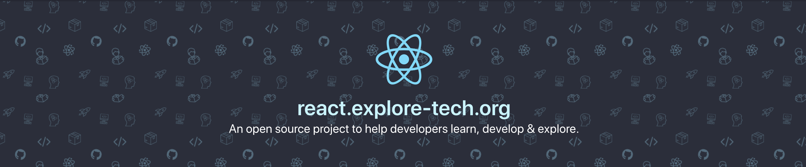

[react.explore-tech.org](https://react.explore-tech.org)

[![MIT License][license-badge]][license]
[![PRs Welcome][prs-badge]][prs]

[![Join the community on Spectrum][spectrum-badge]][spectrum]

## Motivation

I spent a lot of time searching for new libs, frameworks, and ideas. There are currently loads of GitHub repos online that share wonderful projects, but I wanted to build something visual to help people learn and grow.

This website was built based on three main points:

1. Help people learn, develop and explore tech
1. Free and non-profit, all developed and designed to help people.
1. Building a community to share projects together.

# Overall Goal with explore-tech.org

Using this template to design other websites, for example, have a GraphQL, Node, react-native websites to help people explore and learn that tech too. This is all non-profit work, just inspired to help others develop.

# Contributing

Adding material to the website is super easy!

For example to add a new component you would checkout the project and run this command:

`npm run add:component https://github.com/airbnb/react-dates`.

Thats it.

- This would add the component the to the website
- Take a screenshot
- Commit for you

Please read the [Contributing](CONTRIBUTING.md) document for more details.

[spectrum-badge]: https://withspectrum.github.io/badge/badge.svg
[spectrum]: https://spectrum.chat/explore-tech
[license-badge]: https://img.shields.io/badge/License-MIT-yellow.svg
[license]: https://github.com/boyney123/react.explore-tech.org/blob/master/LICENSE
[prs-badge]: https://img.shields.io/badge/PRs-welcome-brightgreen.svg?style=flat-square
[prs]: http://makeapullrequest.com

## Contributors

<!-- ALL-CONTRIBUTORS-LIST:START - Do not remove or modify this section -->
<!-- prettier-ignore -->
<table><tr><td align="center"><a href="https://medium.com/@boyney123"> <b>David Boyne</b></a> <a href="https://github.com/boyney123/react.explore-tech.org/commits?author=boyney123" title="Code">💻</a></td><td align="center"><a href="https://www.tyroprogrammer.com"> <b>Ganesh Bhattarai</b></a> <a href="https://github.com/boyney123/react.explore-tech.org/commits?author=tyroprogrammer" title="Documentation">📖</a></td><td align="center"><a href="https://samundrakc.com.np"> <b>Samundra Khatri</b></a> <a href="https://github.com/boyney123/react.explore-tech.org/commits?author=samundrak" title="Documentation">📖</a></td></tr></table>

<!-- ALL-CONTRIBUTORS-LIST:END -->

Thanks goes to these wonderful people ([emoji key](https://allcontributors.org/docs/en/emoji-key)):

<!-- ALL-CONTRIBUTORS-LIST:START - Do not remove or modify this section -->
<!-- prettier-ignore -->
<!-- ALL-CONTRIBUTORS-LIST:END -->

This project follows the [all-contributors](https://github.com/all-contributors/all-contributors) specification. Contributions of any kind welcome!
