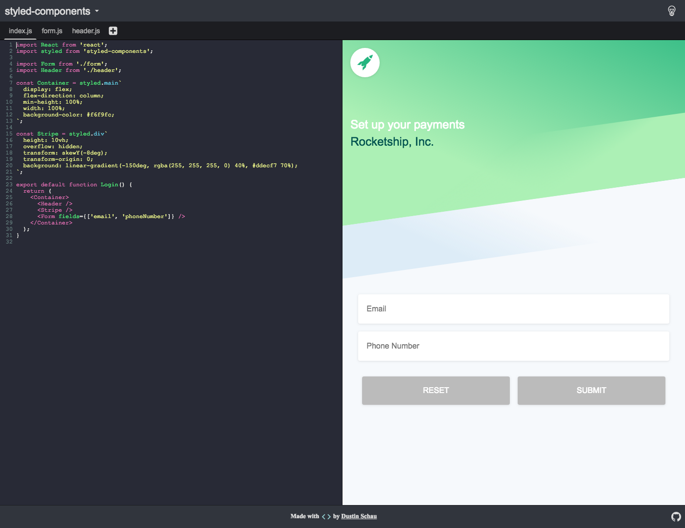

# css-in-js-playground

 

A simple CodeMirror editor showcasing the various CSS in JS styling solutions. Content is previewed live from the editor, and various styling solutions can be swapped out to see how various code snippets look in each.

## Currently supported libraries

<!-- AUTO-GENERATED-CONTENT:START (LIBRARIES) -->
- [aphrodite](./src/snippets/aphrodite/index.js)
- [cxs](./src/snippets/cxs/index.js)
- [emotion](./src/snippets/emotion/index.js)
- [fela](./src/snippets/fela/index.js)
- [glamorous](./src/snippets/glamorous/index.js)
- [inline-styles](./src/snippets/inline-styles/index.js)
- [jss](./src/snippets/jss/index.js)
- [jsxstyle](./src/snippets/jsxstyle/index.js)
- [linaria](./src/snippets/linaria/index.js)
- [radium](./src/snippets/radium/index.js)
- [react-jss](./src/snippets/react-jss/index.js)
- [styled-components](./src/snippets/styled-components/index.js)
- [styletron](./src/snippets/styletron/index.js)
- [yocss](./src/snippets/yocss/index.js)
<!-- AUTO-GENERATED-CONTENT:END (LIBRARIES) -->

## Credits

[Stripe][stripe]: their excellent form mockup served as the basis for each of the current form designs.

[stripe]: https://stripe.com/connect

        