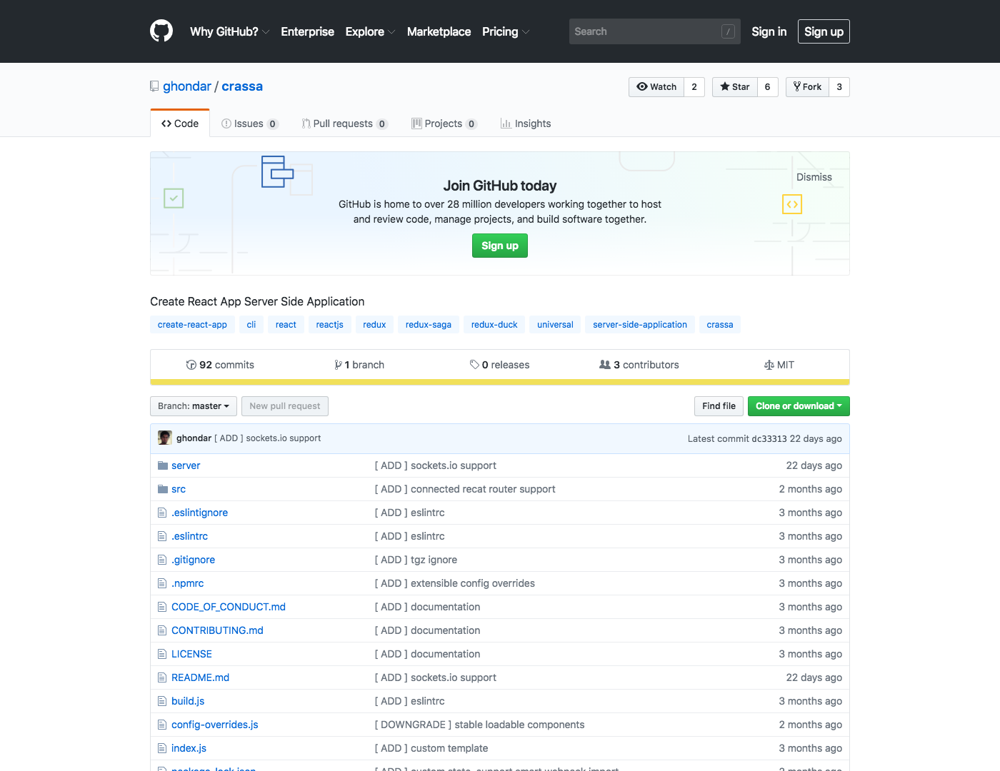

# :sparkles: Create React App Server Side Application

## :battery: A CLI tool to create React + Server Side with one command

#### **This project is a fork of [Crana](https://github.com/scriptify/crana)**

:bulb: To get up and running with an application with a node.js backend and a React frontend, just execute:

```bash
yarn global add crassa
crassa init <projectName> [projectFolder]
```

...and you are ready to go!

This will equip you with all important tools you're going to need to develop powerful applications, for example **Live reaload** for the server and the frontend out of the box.
Webpack, Babel, ESLint, StyleLint, Nodemon etc. etc., all preconfigured out of the box, so that you can focus on the important stuff!

:computer: **Now start developing!**

```bash
yarn dev
```

This will fire up the backend and the frontend development server. Just edit files under **src** and see what happens!

:warning: Crassa is in early stage of development and may not meet all your requirements. That's why contributions of any kind are highly appreciated, as the best tools are built by communities!

## Usage

:star: Create a new crassa project.

```bash
crassa init <projectName> [projectFolderName]
```

:dizzy: Concurrently starts the frontend and the backend in development mode.

```bash
yarn dev
```

:books: See how many LOC you've already written.

```bash
yarn count
```

:mag: Executes eslint and styleling in autofix mode.

```bash
yarn lint
```

:car: Starts the project for production with server side.

```bash
yarn start
```

:blue_car: Creates a production build for the frontend application.

```bash
yarn build
```

## Project structure

The interesting files for you are all located in the **src** folder. The src folder has three subfolders:

- src
- server

As you can imagine, the **src** folder contains all files for the React frontend application and the **server** folder contains all files for the node.js backend.

## Custom Template

You'll be able create custom template from github to generate your initial project:
Github repository structure [like](https://github.com/ghondar/counter-with-redux-ducks-and-sagas-template):

```bash
.
└── template
    ├── nodemon.json
    ├── public
    │   ├── favicon.ico
    │   ├── index.html
    │   └── manifest.json
    ├── server
    │   ├── index.js
    │   └── v1
    │       ├── counter
    │       │   └── index.js
    │       └── index.js
    └── src
        ├── App.js
        ├── App.test.js
        ├── components
        │   └── Common
        │       └── Loading.js
        ├── containers
        │   ├── Dashboard.js
        │   ├── DevTools.js
        │   ├── Root.dev.js
        │   ├── Root.js
        │   └── Root.prod.js
        ├── index.js
        ├── lib
        │   └── Request.js
        ├── reducers
        │   ├── base.js
        │   ├── counter.js
        │   └── index.js
        ├── registerServiceWorker.js
        ├── routes
        │   └── index.js
        ├── sagas
        │   ├── counter.js
        │   └── index.js
        ├── setupProxy.js
        └── store
            ├── configureStore.dev.js
            ├── configureStore.js
            └── configureStore.prod.js
├── .gitignore
├── .npmrc
└── package.json
```

Where package.json basically it must have name and displayName tag with {-- project-name --} and crassa with version tag {-- project-version --} like this:

```json
{
    'name': '{-- project-name --}',
    ...
    'crassa': {
        'displayName': '{-- project-name --}',
        'aliases': {
            ...
        }
    },
    ...
    'dependencies': {
        'crassa':  '{-- project-version --}',
        ...
    },
    ...
}
```

You can put your git when crassa cli ask you to choose betwee custom or default template, the url mus to have this structure:

```bash
ghondar/counter-with-redux-ducks-and-sagas-template
```

## Extensions

Here (**server** folder) you can extend universal middleware creating **preLoadState.js** file to dispatch action from server to load initial state into redux store.

Example: (**/server/preLoadState.js**)

```javascript
import counterDuck from 'reducers/counter'

export default function(req, res, next) {
  if (
    req.baseUrl.indexOf('.') !== -1 ||
    req.baseUrl.indexOf('api') !== -1 ||
    req.baseUrl.indexOf('static') !== -1
  ) {
    next()
  } else {
    // Get store from locals
    const { store } = res.locals
    // Show local resources
    console.log(res.locals)
    // Dispatch a action to change initial state
    store.dispatch(counterDuck.creators.addCount())
    // Resave new store
    res.locals.store = store
    // Pass middlerware
    next()
  }
}
```

Here (**server** folder) you can get the html created in **universal.js** to modify the initial load of DOM or wrapping your app src react project.

Example: (**/server/universal.js**)

```javascript
import { renderToString } from 'react-dom/server'

export const setRenderUniversal = (locals, app) => {
  const { htmlData } = locals
  console.log(locals) // htmlData, store, history

  // store => access to store ( redux )

  const renderString = renderToString(app) // wrapping optional

  const materialStyle = `
      <style id='css-server-side' type='text/css'>
        html { margin:0px; padding:0px }
      </style>
    `

  return {
    prevHtml: html.replace('<head>', `<head>${materialStyle}`),
    renderString, // optional
  }
}
```

We handle initial configuration [here](https://github.com/ghondar/crassa/blob/master/config-overrides.js) adding babel plugins ([transform-imports](https://www.npmjs.com/package/babel-plugin-transform-imports), [loadable-components](https://github.com/smooth-code/loadable-components) and [transform-react-remove-prop-types](https://github.com/oliviertassinari/babel-plugin-transform-react-remove-prop-types)) and webpack alias (basic alias from **package.json**) but you can extend this initial configuration adding to your root project **config-overrides.js** file.

Example: (**/configExpress.js**)

```javascript
import express from 'express'
import session from 'express-session'
import { resolve } from 'path'

export default function(app) {
  app.use(
    session({
      secret: 'Cr4ss4',
      resave: true,
      saveUninitialized: true,
    })
  )

  app.use('/src', express.static(resolve(__dirname, './static')))

  return app
}
```

With **configExpress.js** you can add configurations to express, like statics, uses or add web sockets too.

Example: (**/config-overrides.js**)

```javascript
const {
  override,
  addWebpackAlias,
  addBundleVisualizer,
} = require('customize-cra')

module.exports = override(
  process.env.BUNDLE_VISUALIZE == 1 && addBundleVisualizer()
)
```

## Technologies

As soon as you bootstrapped a new project, you have an application running with:

- Node.js with [Express](https://github.com/expressjs/express) backend.
- React for frontend with [Create React App v2](https://github.com/facebook/create-react-app), [Redux](https://github.com/reduxjs/redux), [Redux Saga](https://github.com/redux-saga/redux-saga) and [Extensible-Duck](https://github.com/investtools/extensible-duck).
- [React-App-Rewired](https://github.com/timarney/react-app-rewired) with [Customize-cra](https://github.com/arackaf/customize-cra) to provide a set of utilities to customize the Create React App v2.

Under the hood it uses Webpack, Babel, ESLint with a few other plugins enabling a powerful development workflow.

## Known constraints/issues

### Windows Linux Subsystem

If you're using Windows Linux Subsystem, eslint will not immediatly work. You need to edit the path under `.vscode/settings.json`.
Replace `C:/mnt/c` with `C:` and it should work.

## Contributing

Have a look at [CONTRIBUTING.md](CONTRIBUTING.md)

## Code of conduct

Have a look at [CODE_OF_CONDUCT.md](CODE_OF_CONDUCT.md)
